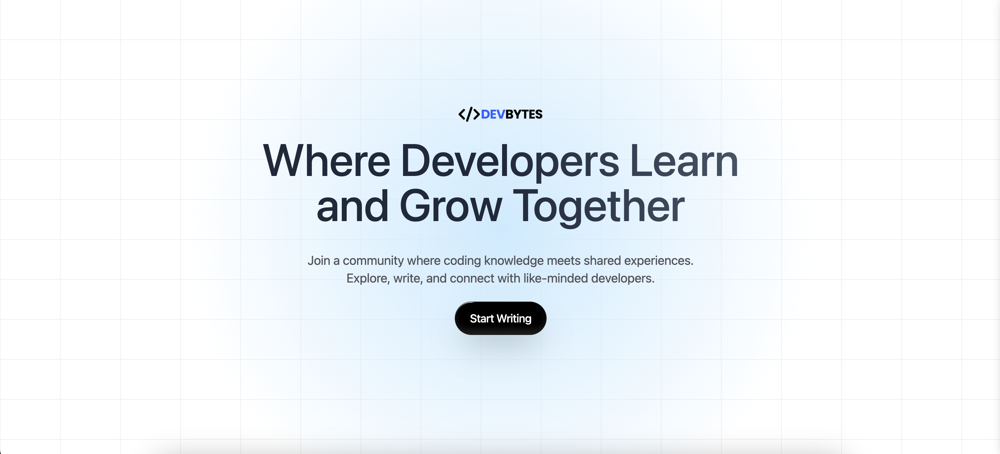

# DevBytes



## Overview

DevBytes is a blogging platform designed for developers. It allows users to create, edit, and publish blog posts, with a focus on topics related to development and technology. The platform is built using React, Tailwind CSS, and Appwrite for backend services.

## Features

### User Authentication
- **Sign Up & Login:** Users can create an account and log in securely.
- **Session Management:** Users remain logged in across sessions, ensuring a seamless experience.

### Blogging Features
- **Create Blog Posts:** Users can create new blog posts with a title, content, tags, and an optional cover image.
- **Edit Blog Posts:** Users can edit their existing blog posts, including changing the content, title, tags, and cover image.
- **Delete Blog Posts:** Users can delete their blog posts when they no longer wish to display them.
- **View All Blogs:** Users can view a feed of all blog posts, including the ability to click through to view the full content of each post.

### Image Management
- **Upload Images:** Users can upload cover images for their blog posts. The images are stored using Appwrite's storage service.
- **Edit Images:** During the edit process, users can change the cover image or keep the existing one.

### Tagging System
- **Add Tags:** Users can add up to three tags to each blog post to categorize the content.
- **Remove Tags:** Tags can be removed during the blog creation or editing process.

### User Profile
- **View Profile:** Users can view their profile, including all the blog posts they have authored.

## Technologies Used
- **React:** For building the user interface.
- **Tailwind CSS:** For styling the application.
- **Appwrite:** As the backend service for authentication, database, and storage.
- **ShadCn:** For adding styling to the UI.
- **React Hook Form:** For form handling.

## Getting Started

### Prerequisites
- Node.js
- NPM or Yarn
- Appwrite instance set up for backend services

### Clone the repository

   ```bash
   git clone https://github.com/Balusekhar/DevBytes.git
